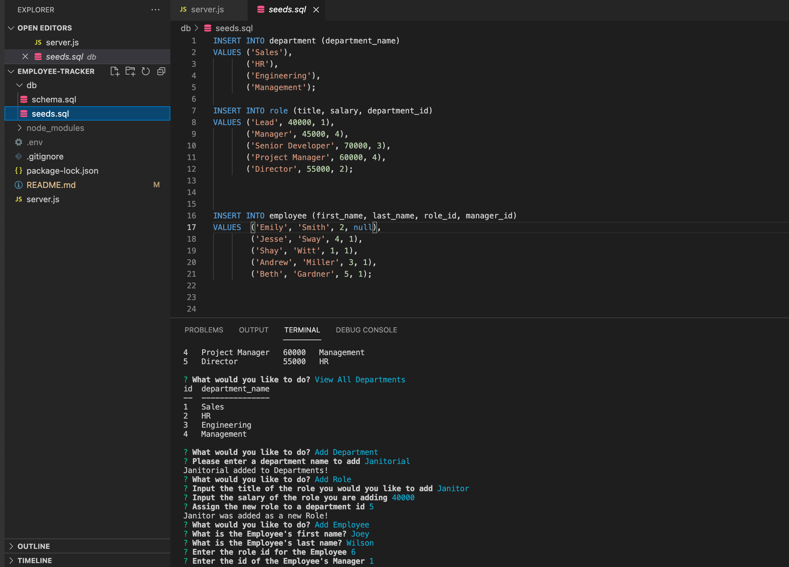

# Employee Management Tracker

## Objective 
A command-line application which runs content management system (CMS) to manage a company's database. The app allows the user to view different tables within the database, add to the tables and update the tables.

## Technologies Used
* SQL, Inquirer, Node.js, Javascript

## Links
* Repo: https://github.com/evapopp/employee-tracker
* Video Demo: https://watch.screencastify.com/v/EQbTGJHP9M2RU4WkTxN2

## Page Preview
